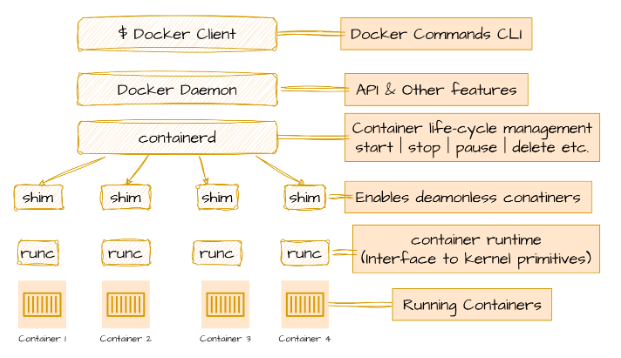
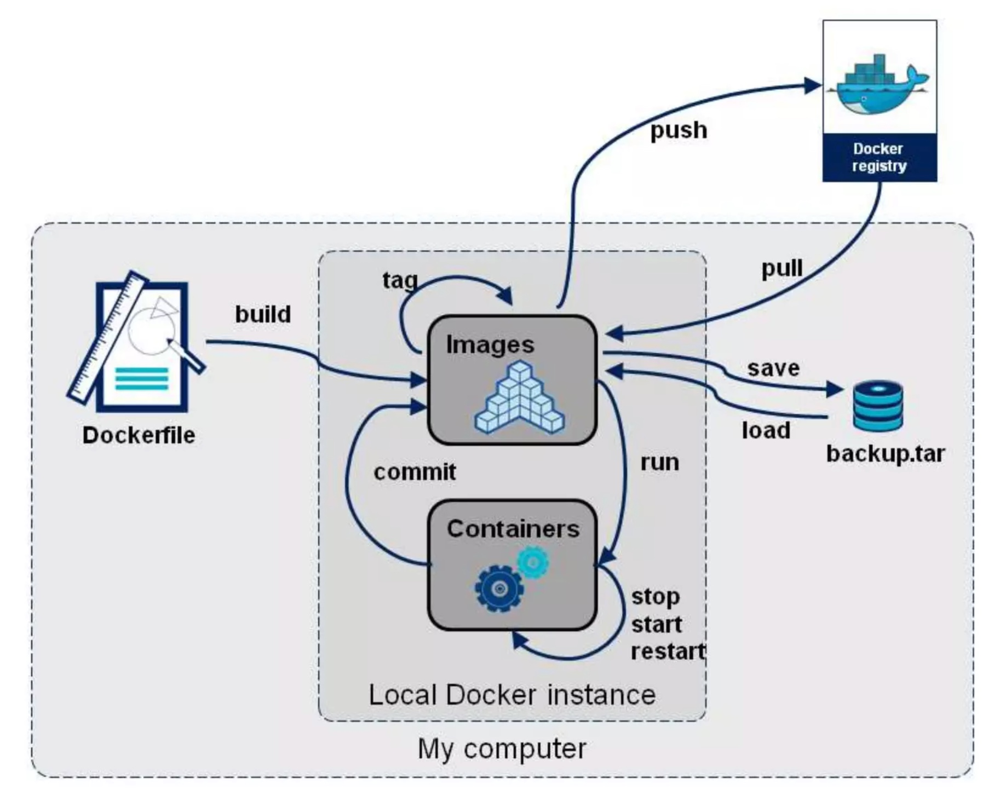

# Container Basics


[How Shipping Containers Revolutionized Global Trade](https://www.linkedin.com/pulse/how-shipping-containers-revolutionized-global-trade-david-conway-ycwyc)

## Installing Docker

There are plenty of ways and places to get Docker up and running. You can do it on Windows, Mac, or Linux. Whether you want it in the cloud, on-prem, or right on your laptop with VMware Workstation or VirtualBox. 

<details>
  <summary>Play with Docker (PWD)</summary>
https://labs.play-with-docker.com/ is a free 4-hour Docker playground which allows users to run Docker commands in a matter of seconds. It gives the experience of having a free Alpine Linux Virtual Machine in browser, where you can build and run Docker containers and even create clusters.
</details>

<details>
  <summary>Install Docker Engine on Ubuntu</summary>
  https://docs.docker.com/engine/install/ubuntu/ <br>
  https://docs.docker.com/engine/install/linux-postinstall/
</details>
Installing Docker Engine directly on Linux is often better for learners compared to using Docker Desktop for a few reasons:

1. **Simplicity**: Linux simplifies Docker installation and usage because Docker was originally designed for Linux. Learners can avoid the complexities and potential issues associated with running Docker through a virtualization layer.
2. **Command Line Proficiency**: Using Docker Engine on Linux encourages learners to become more comfortable with the command line, which is an essential skill for DevOps and development roles.
3. **Access to Native Linux Features**: Docker on Linux can leverage native kernel features directly, providing a more seamless and integrated experience.
4. **Community and Support**: The Docker community and many tutorials are heavily Linux-focused. Learners using Linux will find it easier to follow along with these resources and seek help when needed.

The demos in this document run on a Ubuntu 24.04 LTS VM.

```
ubuntu@docker-host:~$ lsb_release  -a
No LSB modules are available.
Distributor ID:	Ubuntu
Description:	Ubuntu 24.04 LTS
Release:	24.04
Codename:	noble

ubuntu@docker-host:~$ cat /etc/os-release
PRETTY_NAME="Ubuntu 24.04 LTS"
NAME="Ubuntu"
VERSION_ID="24.04"
VERSION="24.04 LTS (Noble Numbat)"
VERSION_CODENAME=noble
ID=ubuntu
ID_LIKE=debian
HOME_URL="https://www.ubuntu.com/"
SUPPORT_URL="https://help.ubuntu.com/"
BUG_REPORT_URL="https://bugs.launchpad.net/ubuntu/"
PRIVACY_POLICY_URL="https://www.ubuntu.com/legal/terms-and-policies/privacy-policy"
UBUNTU_CODENAME=noble
LOGO=ubuntu-logo
```

```
ubuntu@docker-host:~$ docker info
Client: Docker Engine - Community
 Version:    26.1.4
 Context:    default
 Debug Mode: false
 Plugins:
  buildx: Docker Buildx (Docker Inc.)
    Version:  v0.14.1
    Path:     /usr/libexec/docker/cli-plugins/docker-buildx
  compose: Docker Compose (Docker Inc.)
    Version:  v2.27.1
    Path:     /usr/libexec/docker/cli-plugins/docker-compose
......
```

## Docker Concepts

### What is a container?

Excerpt from https://docs.docker.com/guides/docker-concepts/the-basics/what-is-a-container/:

> Without getting too deep, a VM is an entire operating system with its own kernel, hardware drivers, programs, and applications. Spinning up a VM only to isolate a single application is a lot of overhead. 
> 
> A container is simply an isolated process with all of the files it needs to run. If you run multiple containers, they all share the same kernel, allowing you to run more applications on less infrastructure.

> [!NOTE]  
> **Using VMs and containers together**: Quite often, you will see containers and VMs used together. As an example, in a cloud environment, the provisioned machines are typically VMs. However, instead of provisioning one machine to run one application, a VM with a container runtime can run multiple containerized applications, increasing resource utilization and reducing costs.

Run a container:

```
docker run -d -p 8080:80 docker/welcome-to-docker
```
The output from this command is the full container ID. 
```
Unable to find image 'docker/welcome-to-docker:latest' locally
latest: Pulling from docker/welcome-to-docker
96526aa774ef: Pull complete
740091335c74: Pull complete
da9c2e764c5b: Pull complete
ade17ad21ef4: Pull complete
4e6f462c8a69: Pull complete
1324d9977cd2: Pull complete
1b9b96da2c74: Pull complete
5d329b1e101a: Pull complete
Digest: sha256:eedaff45e3c78538087bdd9dc7afafac7e110061bbdd836af4104b10f10ab693
Status: Downloaded newer image for docker/welcome-to-docker:latest
ea219fee063f826773e85ade36ccd3e4ac654aa4b5de2ed3b42374fe745f8886
```
Run `docker ps` to verify the container ID.
```
ubuntu@docker-host:~$ docker ps
CONTAINER ID   IMAGE                      COMMAND                  CREATED         STATUS         PORTS                  NAMES
ea219fee063f   docker/welcome-to-docker   "/docker-entrypoint.…"   8 seconds ago   Up 8 seconds   0.0.0.0:8080->80/tcp   elated_chatterjee
```
> [!NOTE]  
> `docker run` is an alias of `docker container run`. https://docs.docker.com/reference/cli/docker/container/run/

### What is an image?

Excerpt from https://docs.docker.com/guides/docker-concepts/the-basics/what-is-an-image/:

> A container image is a standardized package that includes all of the files, binaries, libraries, and configurations to run a container.

Excerpt from https://docs.vmware.com/en/VMware-vSphere/8.0/vsphere-vm-administration/GUID-E9EAF7AC-1C08-441A-AB80-0BAA1EAF9F0A.html:

> VM Templates are primary copies of virtual machines that you can use to deploy virtual machines that are customized and ready for use. Templates promote consistency throughout your vSphere environment. You can use the content library to store and manage templates of virtual machines and vApps.


> [!TIP]
> A vSphere VM Template is a stopped VM. A container image is a stopped container. 


Search for images using the [`docker search`](https://docs.docker.com/reference/cli/docker/search/) command:

```
docker search nginx
```

```
NAME                               DESCRIPTION                                     STARS     OFFICIAL
nginx                              Official build of Nginx.                        19963     [OK]
unit                               Official build of NGINX Unit: Universal Web …   32        [OK]
nginx/nginx-ingress                NGINX and  NGINX Plus Ingress Controllers fo…   92
nginxinc/nginx-unprivileged        Unprivileged NGINX Dockerfiles                  152
nginx/nginx-prometheus-exporter    NGINX Prometheus Exporter for NGINX and NGIN…   42
nginxinc/nginx-s3-gateway          Authenticating and caching gateway based on …   6
nginx/unit                         This repository is retired, use the Docker o…   63
nginx/nginx-ingress-operator       NGINX Ingress Operator for NGINX and NGINX P…   2
nginxinc/amplify-agent             NGINX Amplify Agent docker repository           1
nginx/nginx-quic-qns               NGINX QUIC interop                              1
nginxinc/ingress-demo              Ingress Demo                                    4
nginxproxy/nginx-proxy             Automated nginx proxy for Docker containers …   139
nginxproxy/acme-companion          Automated ACME SSL certificate generation fo…   134
nginx/unit-preview                 Unit preview features                           0
bitnami/nginx                      Bitnami container image for NGINX               189
bitnami/nginx-ingress-controller   Bitnami container image for NGINX Ingress Co…   34
nginxproxy/docker-gen              Generate files from docker container meta-da…   17
bitnami/nginx-exporter             Bitnami container image for NGINX Exporter      5
nginxinc/mra-fakes3                                                                0
ubuntu/nginx                       Nginx, a high-performance reverse proxy & we…   114
nginxinc/ngx-rust-tool                                                             0
nginxinc/mra_python_base                                                           0
rancher/nginx-ingress-controller                                                   13
kasmweb/nginx                      An Nginx image based off nginx:alpine and in…   8
```

Pull an image using the [`docker pull`](https://docs.docker.com/reference/cli/docker/image/pull/) command.

```
docker pull docker/welcome-to-docker
```

You will see output like the following:

```
Using default tag: latest
latest: Pulling from docker/welcome-to-docker
96526aa774ef: Pull complete
740091335c74: Pull complete
da9c2e764c5b: Pull complete
ade17ad21ef4: Pull complete
4e6f462c8a69: Pull complete
1324d9977cd2: Pull complete
1b9b96da2c74: Pull complete
5d329b1e101a: Pull complete
Digest: sha256:eedaff45e3c78538087bdd9dc7afafac7e110061bbdd836af4104b10f10ab693
Status: Downloaded newer image for docker/welcome-to-docker:latest
docker.io/docker/welcome-to-docker:latest
```

> Each of line represents a different downloaded layer of the image. Remember that each layer is a set of filesystem changes and provides functionality of the image.

List your downloaded images using the [`docker image ls`](https://docs.docker.com/reference/cli/docker/image/ls/) or `docker images` command:

```
docker image ls
```

```
REPOSITORY                 TAG       IMAGE ID       CREATED        SIZE
docker/welcome-to-docker   latest    c1f619b6477e   7 months ago   18.6MB
```

List the image's layers using the [`docker image history`](https://docs.docker.com/reference/cli/docker/image/history/) command:

```
docker image history docker/welcome-to-docker
```

```
IMAGE          CREATED        CREATED BY                                      SIZE      COMMENT
c1f619b6477e   7 months ago   COPY /app/build /usr/share/nginx/html # buil…   1.6MB     buildkit.dockerfile.v0
<missing>      8 months ago   /bin/sh -c #(nop)  CMD ["nginx" "-g" "daemon…   0B
<missing>      8 months ago   /bin/sh -c #(nop)  STOPSIGNAL SIGQUIT           0B
<missing>      8 months ago   /bin/sh -c #(nop)  EXPOSE 80                    0B
<missing>      8 months ago   /bin/sh -c #(nop)  ENTRYPOINT ["/docker-entr…   0B
<missing>      8 months ago   /bin/sh -c #(nop) COPY file:9e3b2b63db9f8fc7…   4.62kB
<missing>      8 months ago   /bin/sh -c #(nop) COPY file:57846632accc8975…   3.02kB
<missing>      8 months ago   /bin/sh -c #(nop) COPY file:3b1b9915b7dd898a…   298B
<missing>      8 months ago   /bin/sh -c #(nop) COPY file:caec368f5a54f70a…   2.12kB
<missing>      8 months ago   /bin/sh -c #(nop) COPY file:01e75c6dd0ce317d…   1.62kB
<missing>      8 months ago   /bin/sh -c set -x     && addgroup -g 101 -S …   9.61MB
<missing>      8 months ago   /bin/sh -c #(nop)  ENV PKG_RELEASE=1            0B
<missing>      8 months ago   /bin/sh -c #(nop)  ENV NGINX_VERSION=1.25.3     0B
<missing>      8 months ago   /bin/sh -c #(nop)  LABEL maintainer=NGINX Do…   0B
<missing>      8 months ago   /bin/sh -c #(nop)  CMD ["/bin/sh"]              0B
<missing>      8 months ago   /bin/sh -c #(nop) ADD file:756183bba9c7f4593…   7.34MB
```

This output shows you all of the layers, their sizes, and the command used to create the layer.

### What is a registry?

Excerpt from https://docs.docker.com/guides/docker-concepts/the-basics/what-is-a-registry/:
> An image registry is a centralized location for storing and sharing your container images. It can be either public or private. Docker Hub is a public registry that anyone can use and is the default registry.
> 
> While Docker Hub is a popular option, there are many other available container registries available today, including Amazon Elastic Container Registry(ECR), Azure Container Registry (ACR), and Google Container Registry (GCR). You can even run your private registry on your local system or inside your organization. For example, Harbor, JFrog Artifactory, GitLab Container registry etc.
> 
> While you're working with registries, you might hear the terms registry and repository as if they're interchangeable. Even though they're related, they're not quite the same thing.
> 
> A registry is a centralized location that stores and manages container images, whereas a repository is a collection of related container images within a registry. Think of it as a folder where you organize your images based on projects. Each repository contains one or more container images.

https://docs.docker.com/docker-hub/quickstart/

https://docs.docker.com/docker-hub/repos/

GitHub and DockerHub serve parallel roles in their respective domains: GitHub for managing and sharing code, and DockerHub for managing and sharing container images.

**Code vs. Container Images**: Just as developers push their code to GitHub to share and collaborate, they push their Docker images to DockerHub. Docker images are essentially packages of applications along with their dependencies, making them easy to distribute and run consistently across different environments.

**Version Control**: Both platforms allow versioning. On GitHub, you have commits and branches for different versions of code. On DockerHub, you have tagged versions of container images.

**Community and Collaboration**: GitHub provides a community space for developers to contribute to open-source projects. Similarly, DockerHub enables sharing of container images, fostering collaboration within the community to build and improve containerized applications.

**Ease of Access**: Both platforms provide easy access to their respective resources. Developers can clone a repository from GitHub to get the code they need, just as they can pull an image from DockerHub to get the necessary container.


## Docker Engine

Excerpt from https://docs.docker.com/engine/:

> Docker Engine is an open source containerization technology for building and containerizing your applications. Docker Engine acts as a client-server application with:
>
> - A server with a long-running daemon process [`dockerd`](https://docs.docker.com/reference/cli/dockerd).
> - APIs which specify interfaces that programs can use to talk to and instruct the Docker daemon.
> - A command line interface (CLI) client [`docker`](https://docs.docker.com/reference/cli/docker/).

Excerpt from https://docs.docker.com/guides/docker-overview/#docker-architecture:

> Docker uses a client-server architecture. The Docker client talks to the Docker daemon, which does the heavy lifting of building, running, and distributing your Docker containers. The Docker client and daemon can run on the same system, or you can connect a Docker client to a remote Docker daemon. The Docker client and daemon communicate using a REST API, over UNIX sockets or a network interface. Another Docker client is Docker Compose, that lets you work with applications consisting of a set of containers.


> [!TIP]
> Docker engine runs and manages containers. VMware ESXi runs and manages VMs.

The main components of the Docker engine include the Docker daemon, the build system, containerd, runc, and various plugins like networking and volumes. These elements work together to create and run containers.



Credit: [Docker - Engine | i2tutorials](https://www.i2tutorials.com/docker-tutorial/docker-engine/)

### Under the Hood of `docker run`

[UNDERSTANDING DOCKER. 1 — INTRODUCTION : | by B.R.O.L.Y | Medium](https://medium.com/@ridwaneelfilali/docker-explained-86987249ad25)

The following `docker run` command starts a container based on `hello-world` image from DockerHub:

```
docker run hello-world
```

Under the hood:

1. You enter command `docker run hello-world` into the Docker CLI, the Docker client translates them into the appropriate API payload and sends them to the API endpoint provided by the Docker daemon.
2. The daemon receives the command to create a new container, it calls containerd. Keep in mind that the daemon no longer contains any code for creating containers.
3. containerd itself cannot create containers; it relies on runc for that task. It converts the necessary Docker image into an OCI bundle and instructs runc to use this bundle to create a new container.
4. runc interacts with the OS kernel to assemble all the necessary constructs for creating a container, such as namespaces and cgroups. The container process begins as a child process of runc, and once it starts, runc exits.

 

Credit: [Docker Engine Architecture Under the Hood | by Yeldos Balgabekov | Medium](https://medium.com/@yeldos/docker-engine-architecture-under-the-hood-741512b340d5)


## Play with Docker


Credit: https://www.slideshare.net/slideshow/docker-41045742/41045742

### Review Docker Terms

- **Image**: A container image is a read-only package that includes everything needed to run an application. This includes the application code, dependencies, a minimal set of OS constructs, and metadata. One image can be used to start multiple containers.
	
	> [!NOTE]  
	> Image, Docker image, container image, and OCI image are interchangeable terms.
- **Container**: A container is simply an isolated process with all of the files it needs to run. If you run multiple containers, they all share the same kernel, allowing you to run more applications on less infrastructure.
- **Registry**: An image registry is a centralized location for storing and sharing your container images. It can be either public or private. Docker Hub is a public registry that anyone can use and is the default registry.

### Docker CLI Cheat Sheet

[Official Get Started Docker CLI Cheat Sheet](https://docs.docker.com/get-started/docker_cheatsheet.pdf)

[The Ultimate Docker Cheat Sheet | dockerlabs (collabnix.com)](https://dockerlabs.collabnix.com/docker/cheatsheet/)

### Run Two Containers from the Same Image

Start an Alpine Linux container:

```shell
# This command runs on the host
docker run -it alpine
```

Excerpt from [docker run | Docker Docs](https://docs.docker.com/reference/cli/docker/container/run/):

> The `docker run` command runs a command in a new container, pulling the image if needed and starting the container. `-it` options open a shell inside a running container.
>
> Option:
>
> - `-i` or `--interactive`: Keep STDIN open even if not attached
> - `-t` or `--tty`: Allocate a pseudo-TTY

You will see output like the following:

```
Unable to find image 'alpine:latest' locally
latest: Pulling from library/alpine
ec99f8b99825: Pull complete
Digest: sha256:b89d9c93e9ed3597455c90a0b88a8bbb5cb7188438f70953fede212a0c4394e0
Status: Downloaded newer image for alpine:latest
/ #
```

Check the OS information inside the running container:
```
# This command runs inside the container
/ # cat /etc/os-release
NAME="Alpine Linux"
ID=alpine
VERSION_ID=3.20.1
PRETTY_NAME="Alpine Linux v3.20"
HOME_URL="https://alpinelinux.org/"
BUG_REPORT_URL="https://gitlab.alpinelinux.org/alpine/aports/-/issues"
```

Use `ps aux` to list all processes running inside the container:

```
# This command runs inside the container
/ # ps aux
PID   USER     TIME  COMMAND
    1 root      0:00 /bin/sh
    8 root      0:00 ps aux
```

On the host, run `docker container ls` to list containers:

```
# This command runs on the host
docker container ls
CONTAINER ID   IMAGE     COMMAND     CREATED          STATUS          PORTS     NAMES
6c272c60442b   alpine    "/bin/sh"   19 minutes ago   Up 19 minutes             crazy_faraday
```
> [!NOTE]  
> `crazy_faraday` is the random container name generated by Docker if no container name is specified in the `docker run` command. [moby/pkg/namesgenerator/names-generator.go at master · moby/moby (github.com)](https://github.com/moby/moby/blob/master/pkg/namesgenerator/names-generator.go)
>
> `docker container ls` has many aliases: `docker container list` `docker container ps` and `docker ps`. `docker ps` is the most popular one. [docker ps | Docker Docs](https://docs.docker.com/reference/cli/docker/container/ls/)


Start another Alpine Linux container using the identical `docker run` command:

```shell
# This command runs on the host
docker run -it alpine
```

On the host, run `docker ps` to list containers:

```
# This command runs on the host
docker ps
CONTAINER ID   IMAGE     COMMAND     CREATED          STATUS          PORTS     NAMES
5db5a74490d5   alpine    "/bin/sh"   7 seconds ago    Up 6 seconds              reverent_sutherland
6c272c60442b   alpine    "/bin/sh"   26 minutes ago   Up 26 minutes             crazy_faraday
```

Create a new file inside `crazy_faraday` container:

```
# These commands run inside the crazy_faraday container
/ # touch /a-new-file.txt
/ # ls /
a-new-file.txt  etc             media           proc            sbin            tmp
bin             home            mnt             root            srv             usr
dev             lib             opt             run             sys             var
```

List the files inside `reverent_sutherland` container:

```
# This command runs inside the reverent_sutherland container
/ # ls /
bin    etc    lib    mnt    proc   run    srv    tmp    var
dev    home   media  opt    root   sbin   sys    usr
```

It's evident that the two containers created from the same image have isolated storage. The `a-new-file.txt` file exists inside `crazy_faraday` container only.

Run `uname -a` on both containers and the host:

```
# This command runs inside the crazy_faraday container
/ # uname -a
Linux 5361e28bfc38 6.8.0-35-generic #35-Ubuntu SMP PREEMPT_DYNAMIC Mon May 20 15:51:52 UTC 2024 x86_64 Linux
```

```
# This command runs inside the reverent_sutherland container
/ # uname -a
Linux 1d9204993126 6.8.0-35-generic #35-Ubuntu SMP PREEMPT_DYNAMIC Mon May 20 15:51:52 UTC 2024 x86_64 Linux
```

```
# This command runs on the host
ubuntu@docker-host:~$ uname -a
Linux docker-host 6.8.0-35-generic #35-Ubuntu SMP PREEMPT_DYNAMIC Mon May 20 15:51:52 UTC 2024 x86_64 x86_64 x86_64 GNU/Linux
```

This demo proves that [If you run multiple containers, they all share the same kernel, allowing you to run more applications on less infrastructure.](https://docs.docker.com/guides/docker-concepts/the-basics/what-is-a-container/#:~:text=A container is simply an,more applications on less infrastructure.&text=Quite often%2C you will see containers and VMs used together.)

Run `ps aux | grep '/bin/sh'` on the host to list container processes:

```
# This command runs on the host
ubuntu@docker-host:~$ ps aux | grep '/bin/sh'
root        2611  0.0  0.0   1724  1024 pts/0    Ss+  00:47   0:00 /bin/sh
root        3063  0.0  0.0   1724  1024 pts/0    Ss+  01:14   0:00 /bin/sh
ubuntu      3141  0.0  0.0   6544  2304 pts/2    S+   01:25   0:00 grep --color=auto /bin/sh
```

Run `exit` inside the `reverent_sutherland` container then run `docker ps` on the host:

```
# This command runs on the host
ubuntu@docker-host:~$ docker ps
CONTAINER ID   IMAGE     COMMAND     CREATED          STATUS          PORTS     NAMES
6c272c60442b   alpine    "/bin/sh"   40 minutes ago   Up 40 minutes             crazy_faraday
```

Run `ps aux | grep '/bin/sh'` on the host again to list container processes:

```
# This command runs on the host
ubuntu@docker-host:~$ ps aux | grep '/bin/sh'
root        2611  0.0  0.0   1724  1024 pts/0    Ss+  00:47   0:00 /bin/sh
ubuntu      3200  0.0  0.0   6544  2304 pts/2    S+   01:29   0:00 grep --color=auto /bin/sh
```

Run `sudo kill -9 2611` on the host to kill the `/bin/sh` process then run `docker ps` on the host:

```
# These commands run on the host
ubuntu@docker-host:~$ sudo kill -9 2611
ubuntu@docker-host:~$ ps aux | grep '/bin/sh'
ubuntu      3257  0.0  0.0   6544  2304 pts/2    S+   01:30   0:00 grep --color=auto /bin/sh
ubuntu@docker-host:~$ docker ps
CONTAINER ID   IMAGE     COMMAND   CREATED   STATUS    PORTS     NAMES
```

This demo proves that [A container is simply an isolated process with all of the files it needs to run.](https://docs.docker.com/guides/docker-concepts/the-basics/what-is-a-container/#:~:text=A container is simply an,more applications on less infrastructure.&text=Quite often%2C you will see containers and VMs used together.)

### Docker Lifecycle Commands

List of `docker container` commands: [docker container | Docker Docs](https://docs.docker.com/reference/cli/docker/container/)

#### `docker run -d`

Run container in background and print container ID.

#### `docker ps -a`

Show all containers (default shows just running).

```
# This command runs on the host
ubuntu@docker-host:~$ docker ps -a
CONTAINER ID   IMAGE         COMMAND     CREATED             STATUS                         PORTS     NAMES
5db5a74490d5   alpine        "/bin/sh"   25 minutes ago      Exited (0) 11 minutes ago                reverent_sutherland
6c272c60442b   alpine        "/bin/sh"   51 minutes ago      Exited (137) 9 minutes ago               crazy_faraday
b0a454d2a766   hello-world   "/hello"    About an hour ago   Exited (0) About an hour ago             charming_blackwell
```

#### `docker start [OPTIONS] CONTAINER`

Start one or more stopped containers.

```
# This command runs on the host
ubuntu@docker-host:~$ docker container start 5db5a74490d5
5db5a74490d5
ubuntu@docker-host:~$ docker ps
CONTAINER ID   IMAGE     COMMAND     CREATED          STATUS         PORTS     NAMES
5db5a74490d5   alpine    "/bin/sh"   26 minutes ago   Up 1 second              reverent_sutherland
```

#### `docker container attach`

Attach local standard input, output, and error streams to a running container.

```
# This command runs on the host
ubuntu@docker-host:~$ docker attach 5db5a74490d5
/ #
```

> [!NOTE]  
> `docker attach` is an alias of `docker container attach`. 

#### `docker container stop`

Stop one or more running containers. The main process inside the container will receive `SIGTERM`, and after a grace period, `SIGKILL`.

```
# This command runs on the host
ubuntu@docker-host:~$ docker stop 5db5a74490d5
5db5a74490d5
```

> [!NOTE]  
> `docker stop` is an alias of `docker container stop`. 

Observe the time it takes to stop a container.

#### `docker container kill`

Kill one or more running containers. The main process inside the container is sent `SIGKILL` signal (default), or the signal that is specified with the `--signal` option.

```
# This command runs on the host
ubuntu@docker-host:~$ docker kill 5db5a74490d5
5db5a74490d5
```

> [!NOTE]  
> `docker kill` is an alias of `docker container kill`. 

Observe the time it takes to kill a container.

#### `docker stop` vs. `docker kill`

Using `docker stop` provides a more graceful way to halt a container, allowing the main process to perform cleanup tasks before terminating. In contrast, the `docker kill` command forcefully stops the container immediately, without waiting for any cleanup. The decision between using `docker stop` and `docker kill` depends on whether you want to allow the processes inside the container time to clean up before termination.

[Difference Between docker stop and docker kill Commands | Baeldung on Ops](https://www.baeldung.com/ops/docker-stop-vs-kill)

#### `docker rm`

Remove one or more containers.

```
# These commands run on the host

# Before docker rm
ubuntu@docker-host:~$ docker ps -a
CONTAINER ID   IMAGE         COMMAND     CREATED             STATUS                        PORTS     NAMES
5db5a74490d5   alpine        "/bin/sh"   37 minutes ago      Exited (137) 2 minutes ago              reverent_sutherland
6c272c60442b   alpine        "/bin/sh"   About an hour ago   Exited (137) 21 minutes ago             crazy_faraday
b0a454d2a766   hello-world   "/hello"    2 hours ago         Exited (0) 8 minutes ago                charming_blackwell

ubuntu@docker-host:~$ docker rm 5db5a74490d5
5db5a74490d5

# After docker rm
ubuntu@docker-host:~$ docker ps -a
CONTAINER ID   IMAGE         COMMAND     CREATED             STATUS                        PORTS     NAMES
6c272c60442b   alpine        "/bin/sh"   About an hour ago   Exited (137) 21 minutes ago             crazy_faraday
b0a454d2a766   hello-world   "/hello"    2 hours ago         Exited (0) 8 minutes ago                charming_blackwell
```

### Docker Image Commands

#### `docker image ls`

List images.

```
# This command runs on the host
ubuntu@docker-host:~$ docker images
REPOSITORY                 TAG       IMAGE ID       CREATED         SIZE
alpine                     latest    a606584aa9aa   3 days ago      7.8MB
docker/welcome-to-docker   latest    c1f619b6477e   7 months ago    18.6MB
hello-world                latest    d2c94e258dcb   13 months ago   13.3kB
```

> [!NOTE]  
> `docker images` is an alias of `docker image ls`. 

#### `docker image rm`

Remove one or more images. Removes (and un-tags) one or more images from the host node. If an image has multiple tags, using this command with the tag as a parameter only removes the tag. If the tag is the only one for the image, both the image and the tag are removed.

```
# These commands run on the host

ubuntu@docker-host:~$ docker ps -a
CONTAINER ID   IMAGE         COMMAND     CREATED             STATUS                      PORTS     NAMES
6c272c60442b   alpine        "/bin/sh"   About an hour ago   Up 7 minutes                          crazy_faraday
b0a454d2a766   hello-world   "/hello"    2 hours ago         Exited (0) 17 minutes ago             charming_blackwell

ubuntu@docker-host:~$ docker rm b0a454d2a766
b0a454d2a766

ubuntu@docker-host:~$ docker rmi hello-world
Untagged: hello-world:latest
Untagged: hello-world@sha256:94323f3e5e09a8b9515d74337010375a456c909543e1ff1538f5116d38ab3989
Deleted: sha256:d2c94e258dcb3c5ac2798d32e1249e42ef01cba4841c2234249495f87264ac5a
Deleted: sha256:ac28800ec8bb38d5c35b49d45a6ac4777544941199075dff8c4eb63e093aa81e
```

This does not remove images from a registry. You cannot remove an image of a running container unless you use the `-f` option. 

```
# This command runs on the host
ubuntu@docker-host:~$ docker rmi alpine:latest
Error response from daemon: conflict: unable to remove repository reference "alpine:latest" (must force) - container 6c272c60442b is using its referenced image a606584aa9aa
```

> [!NOTE]  
> `docker rmi` is an alias of `docker image rm`. 

#### `docker image prune`

Remove all dangling images. If `-a` is specified, also remove all images not referenced by any container.

```
# These commands run on the host

ubuntu@docker-host:~$ docker images
REPOSITORY                 TAG       IMAGE ID       CREATED        SIZE
alpine                     latest    a606584aa9aa   3 days ago     7.8MB
docker/welcome-to-docker   latest    c1f619b6477e   7 months ago   18.6MB

ubuntu@docker-host:~$ docker ps -a
CONTAINER ID   IMAGE     COMMAND   CREATED   STATUS    PORTS     NAMES

ubuntu@docker-host:~$ docker image prune -a
WARNING! This will remove all images without at least one container associated to them.
Are you sure you want to continue? [y/N] y
Deleted Images:
untagged: alpine:latest
untagged: alpine@sha256:b89d9c93e9ed3597455c90a0b88a8bbb5cb7188438f70953fede212a0c4394e0
deleted: sha256:a606584aa9aa875552092ec9e1d62cb98d486f51f389609914039aabd9414687
deleted: sha256:94e5f06ff8e3d4441dc3cd8b090ff38dc911bfa8ebdb0dc28395bc98f82f983f
untagged: docker/welcome-to-docker:latest
untagged: docker/welcome-to-docker@sha256:eedaff45e3c78538087bdd9dc7afafac7e110061bbdd836af4104b10f10ab693
deleted: sha256:c1f619b6477e36a0b6a2531a972e918ef32bbf0217ee9b536409361261db6df0
deleted: sha256:503c5cd6e10d87f52ccbcbe0fee9b033c6df11dee055c636caa64f65227d02cc
deleted: sha256:12369c7fe5ffb31bc592a24c0cd081c85f34702da4b747ede00543e6f7f54a74
deleted: sha256:2b3208f4feef2df0b1c11744e87d2a5c41a1ef41a1217f7d90f1e7c1dab2ee30
deleted: sha256:97912e57274d7772d7f052fe2d671c5e0ac193863e9d5d02d2575949c17e1cd0
deleted: sha256:8d49f96bd3dac9f64c8b46bda71c268caa7eafb1d9fde95b93a36133a1e805fc
deleted: sha256:2765f389f779d9903825e36b704119da1da13faa4e73a44478fd86f577f4b738
deleted: sha256:baeb76f1ff72a2a650534f62c17308491c058905a82289971c604dea72fe54ed
deleted: sha256:cc2447e1835a40530975ab80bb1f872fbab0f2a0faecf2ab16fbbb89b3589438

Total reclaimed space: 26.35MB
```


---

Todo List:

- [x] Docker components
- [x] Docker engine
- [x] Play with Docker - Docker CLI examples
- [ ] Docker image
- [ ] Docker networking
- [ ] Docker storage
